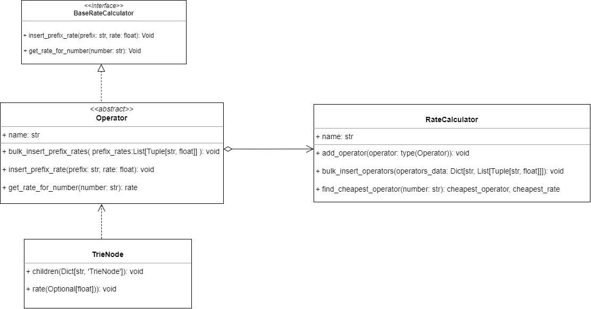
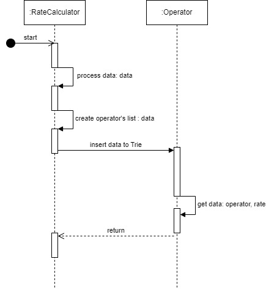
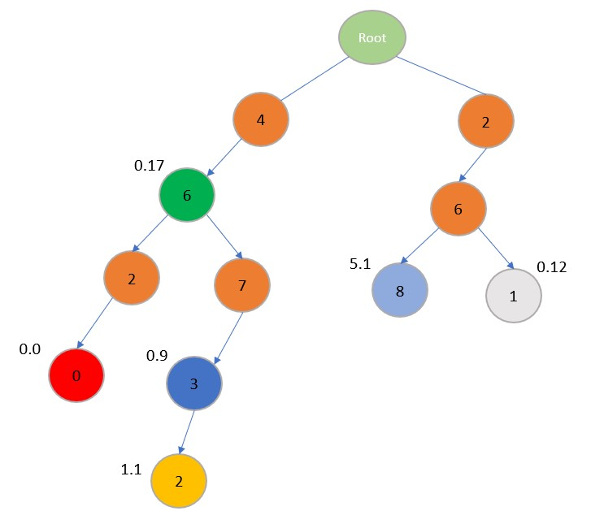

ROUTING OF TELEPHONE CALLS
==============================================

Introduction
------------
Welcome to the document of the **Routing of telephone calls**. This document aims to provide a detailed understanding of the code design, key components, data structure. 

Application Purpose
--------------------
**Routing of telephone calls**  is purpose-built for the task of handling any number of operator and then calculate which operator that is cheapest for a certain phone number.

Code Design
--------------------

Four classes : 
1. TrieNode [ Create the node ]
2. Operator [ Search and insert the data]
3. RateCalculator [ Preprocess input data, get the output ]
4. BaseRateCalculator [ Acts as interface for Operator class ].

Code Diagram :
--------------------

There are two main classes :

1. RateCalculator 
* This class main purpose is to process input data and create a list contain each operator separately.
2. Operator
* The operator class main purpose is to insert and search for prefixes and its rate then return result back to main class.

Explanation
--------------------
In this code assignment I utilize the Trie data structure (prefix tree) for storing the prefixes according with their rate. The reason I choosed Trie is because Tries are efficient for matching prefixes in strings, which is exactly what we need for telephone number prefixes. Each node in the trie will represent a digit of the prefix. The nodes will store the rate for the prefix ending at that node.

Here I assume phone number is a legit one as in the exercise (+46-73-212345), the price per minute can goes to infinity that means can be very large price. 

**Inserting**:

* Suppose below is our Operator example, we have operator A has a list of prefixes and price per minute ('46' is prefix, 0.17 is price per minute)

    Initially our Trie is empty , for example if we want to insert the prefix , let's say ('46', 0.17) into the Trie , we're going to create a node for the digit 4 then we're going to create another node for the digit 6, and we will keep doing this for every digit in our prefix and price pairs. And everytime we insert new digit we're going to insert it as a child of the previous digit.

    And finally one more thing we have to do to say this is the prefix that we've inserted is to mark the end of the prefix with its rate.

    `"Operator A": [('46', 0.17), ('4620', 0.0), ('4673', 0.9), ('268', 5.1), ('4672', 1.1)]`

**Searching**:

* Let's we search for the 46 in our Trie .

    Start from the root of the Trie, does the root have the child of the first digit we're looking for ?, let's say 4 in our case , the answer is Yes. For the digit 4, we're now looking for digit 6, does digit 4 have child 6 digit? , the answer is Yes again. We're going digit by digit in the phone number we're searching and checking if node exists for each digit in the phone number consecutively.

    6 is our last digit we're searching for. Does the 6 mark at the end of prefix?. Yes it is (we marked it in green with the rate of 0.17 as shown in below image)

Tests
--------------------
The test cases are fairly straight forward. We have total 5 tests covering some cases:

* test_insert_prefix_rate [ instert prefix and rate pair one by one]
* test_bulk_insert_prefix_rates [ bulk instert prefix and rate pairs]
* test_find_cheapest_operator [ given phone number, find cheapest operator]
* test_no_operator_found [ return None if there aren't any operator found for input phone number]
* test_with_large_dataset [ Insert data with thousands of entries ]

How to run
--------------------
[ Run the script to see the output ]

CD to /src and run

`python3 rate_calculator.py`

[ Run the test case ]

CD to /src and run

`python3 tests/test_rate_calculator.py`

